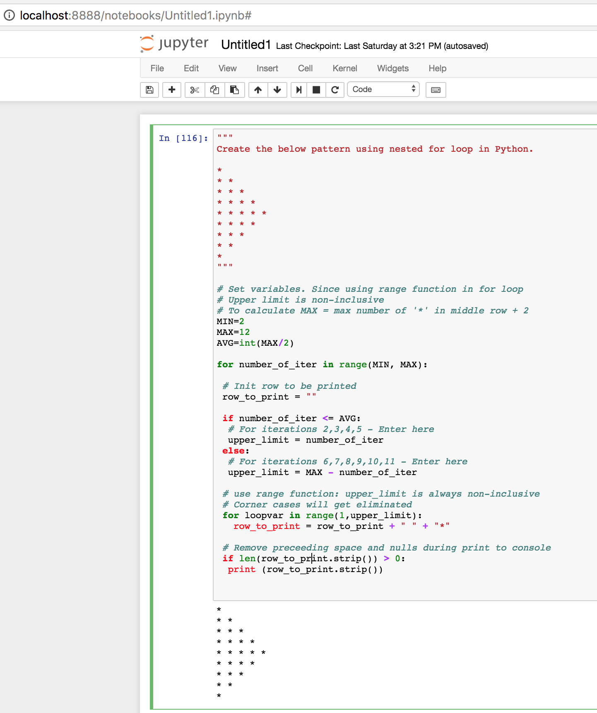

# Problem Statement :
```
Create the below pattern using nested for loop in Python.

*
* *
* * *
* * * *
* * * * *
* * * *
* * *
* *
*
```

## Snapshot - Run from jupyter REPL 
```
import pattern_display.ipynb in jupyter REPL 
```




## Snapshot - Run from command line bash
```
Command to execute : python pattern_display.py
```


